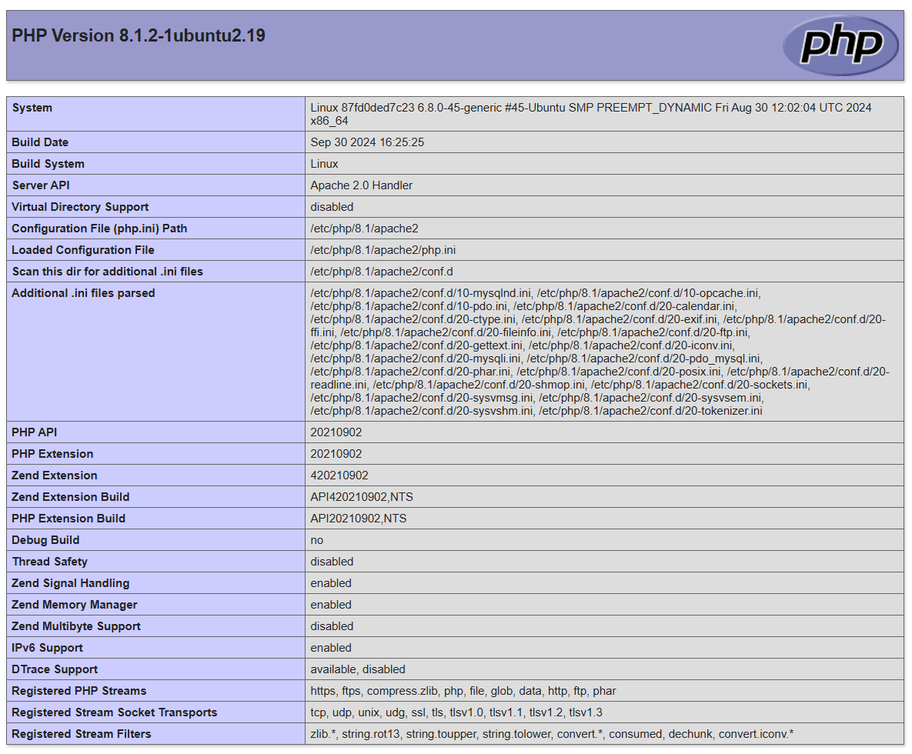
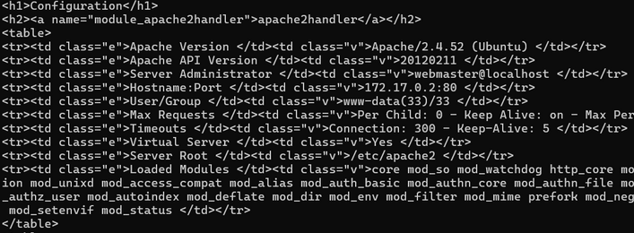
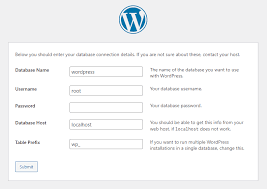
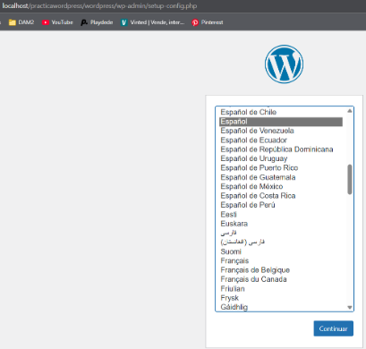
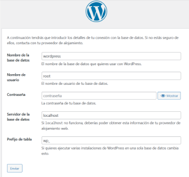
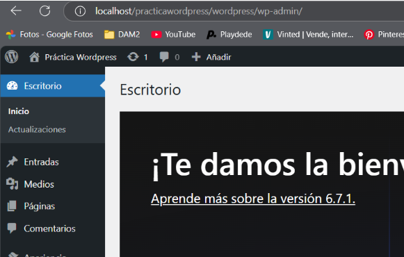

# Tarea 04 :: LAMPP

## Enunciado
Crear un  fichero (nombre "Readme.md") con formato markdown en un repositorio en github para subir este fichero y hacer commits que indiquen lo realizado.

## 1. Utiliza la imagen de Ubuntu , tag 22 y apoyandote en esta guía sigue sus instrucciones para instalar LAMPP en dicho contenedor.
```bash
# Contenedores e imágenes
sudo docker pull ubuntu:22.04

sudo docker images # comprobación

sudo docker container create -i -t  -p  8080:80 --name wordpress ubuntu:22.04

sudo docker container start --attach -i wordpress # lanza el container

# Servicios 
sudo apt install -y apache2 apache2-utils # instala apache

sudo apt install -y mariadb-server mariadb-client # instala mariadb

sudo apt install -y php php-mysql libapache2-mod-php # instala php

service mariadb start # inicia mariadb
```

Prueba de apache:
```bash
echo "<?php phpinfo(); ?>" | sudo tee /var/www/html/info.php

http://IPlocal/info.php
```


Prueba de php:
```bash
curl http://localhost/info.php 
```


## 2. Utiliza esta guía para instalar wordpress en el contenedor.
```bash
sudo apt install ghostscript \
                 libapache2-mod-php \
                 mysql-server \
                 php \
                 php-bcmath \
                 php-curl \
                 php-imagick \
                 php-intl \
                 php-json \
                 php-mbstring \
                 php-mysql \
                 php-xml \
                 php-zip

sudo mkdir -p /srv/www

sudo chown www-data: /srv/www # muy importante darle los permisos necesarios

curl https://wordpress.org/latest.tar.gz | tar zx -C /srv/www

y redirigir la configuración a este archivo
cat <<EOF > /etc/apache2/sites-available/wordpress.conf
<VirtualHost *:80>
    DocumentRoot /srv/www/wordpress
    <Directory /srv/www/wordpress>
        Options FollowSymLinks
        AllowOverride Limit Options FileInfo
        DirectoryIndex index.php
        Require all granted
    </Directory>
    <Directory /srv/www/wordpress/wp-content>
        Options FollowSymLinks
        Require all granted
    </Directory>
</VirtualHost>
EOF

# Servicios wordpress y apache2
service apache2 reload

a2ensite wordpress

sudo a2enmod rewrite

# Ejecución de servicios
service apache2 restart

sudo a2dissite 000-default

service apache2 reload
```

Confuguración de la base de datos mysql:
```bash
mysql -u root
CREATE DATABASE wordpress;
CREATE USER 'wordpress'@'localhost' IDENTIFIED BY '<your-password>';
GRANT SELECT, INSERT, UPDATE, DELETE, CREATE, DROP, ALTER ON wordpress.* TO 'wordpress'@'localhost';
FLUSH PRIVILEGES;
QUIT;
```

## 3. Acceso a Wordpress

Configuración Wordpress:
```bash
http://localhost:8080/wp-admin/setup-config.php
```







